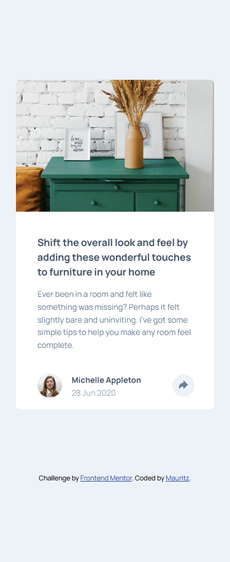
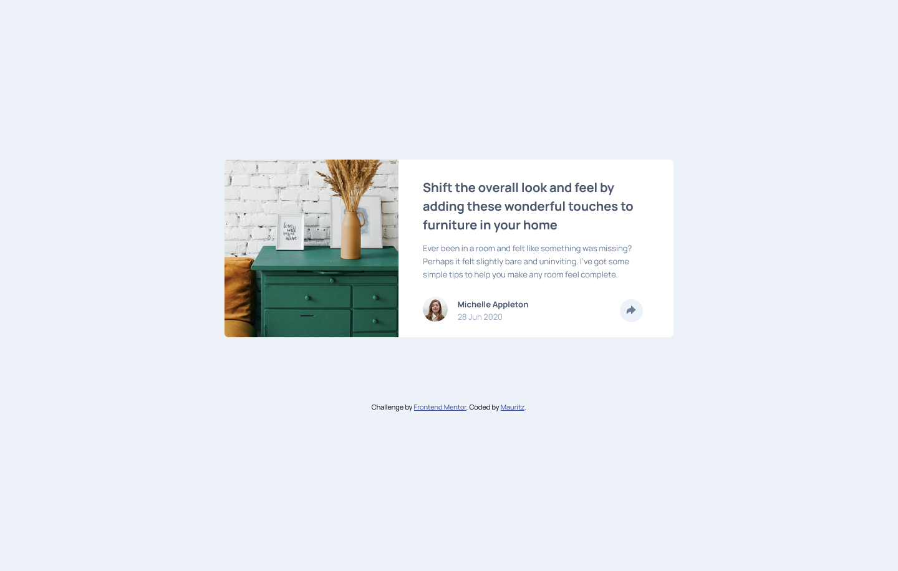

# Frontend Mentor - Article preview component solution

This is a solution to the [Article preview component challenge on Frontend Mentor](https://www.frontendmentor.io/challenges/article-preview-component-dYBN_pYFT). Frontend Mentor challenges help you improve your coding skills by building realistic projects. 

## Table of contents

- [Overview](#overview)
  - [The challenge](#the-challenge)
  - [Screenshot](#screenshot)
  - [Links](#links)
- [My process](#my-process)
  - [Built with](#built-with)
  - [What I learned](#what-i-learned)
  - [Continued development](#continued-development)
  - [Useful resources](#useful-resources)
- [Author](#author)

## Overview

### The challenge

Users should be able to:

- View the optimal layout for the component depending on their device's screen size
- See the social media share links when they click the share icon

### Screenshot




### Links

- Solution URL: [solution URL](https://www.frontendmentor.io/solutions/article-preview-component-html-and-css-Cy9KtWoXtQ)
- Live Site URL: [live site URL](https://mauritzlm.github.io/article-preview-component/)

## My process

### Built with

- Semantic HTML5 markup
- CSS custom properties
- Flexbox
- Mobile-first workflow

### What I learned

I learned about how to use :focus to create a popup or dropdown.
Here I am selecting the social popup while the share icon(button) is focused and using :focus-within to keep the social popup open while tabbing throught the social links on desktop.

```css
.share-icon:focus+.social {
    visibility: visible;
}

 .social:focus-within {
        visibility: visible;
        transform: rotateX(0) translateX(0);
    }
```
I also learned that one can create an arrow on the border of a box using ::after. (https://www.w3schools.com/howto/howto_js_popup.asp)

### Continued development

I want to continue learning about html and css best practices when planning and implementing a layout. 

### Useful resources

- [Popup tutorial](https://www.w3schools.com/howto/howto_js_popup.asp) - Tutorial on how to create popups. I'm sure I'll be using this again in the future.
- [CSS only accessible dropdown](https://moderncss.dev/css-only-accessible-dropdown-navigation-menu/) - I learned a lot from this article, including using :focus-within and using rotateX(-90%) to remove height so one can add an animation.

## Author

- Frontend Mentor - [@MauritzLM](https://www.frontendmentor.io/profile/MauritzLM)


